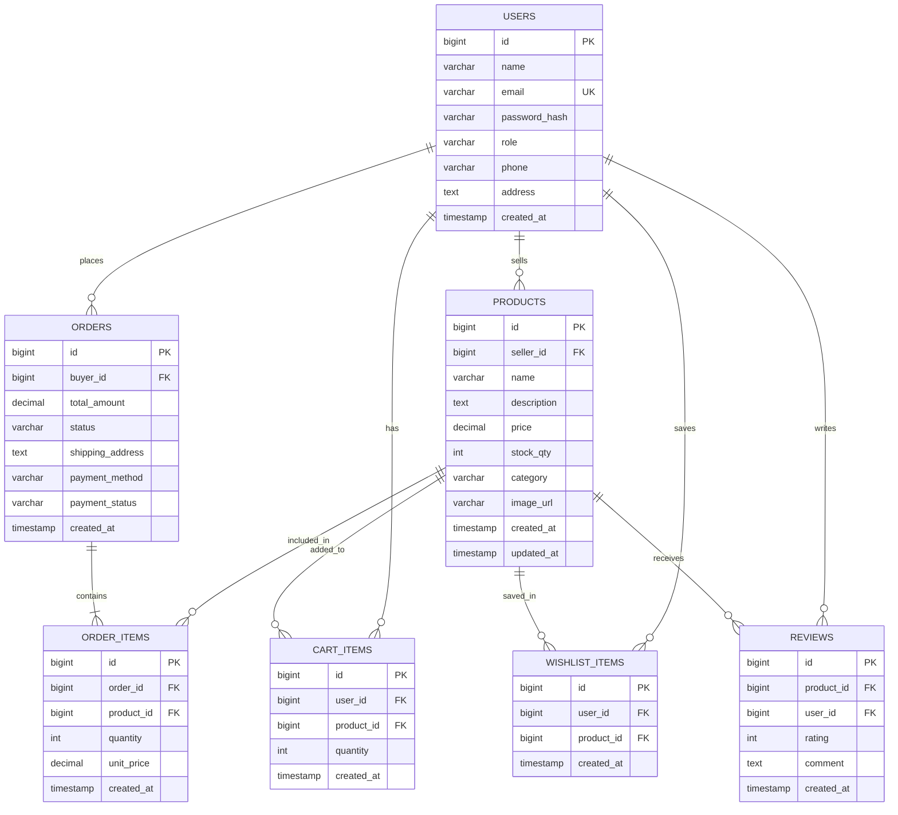
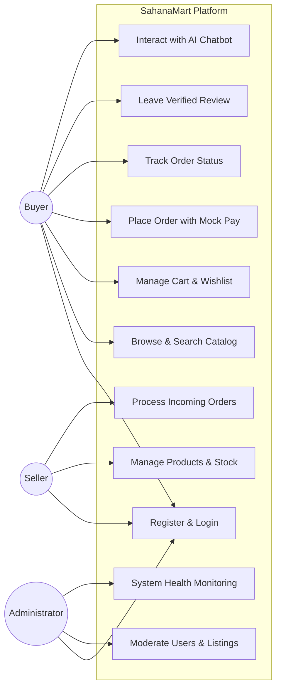
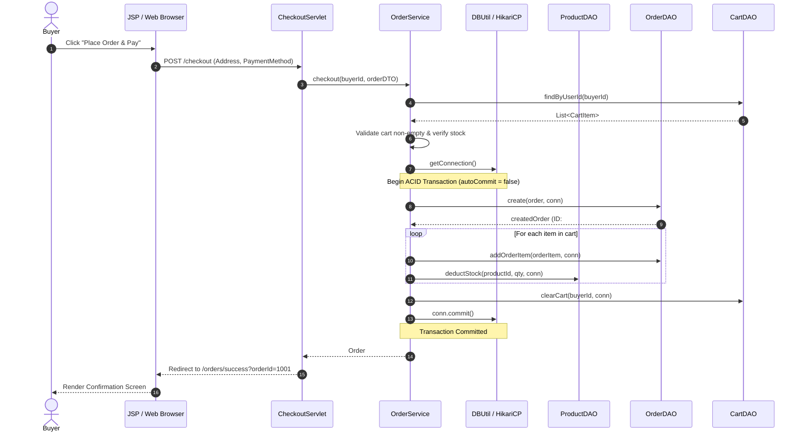

# SahanaMart: Enterprise E-Commerce Platform
## Final Capstone Project Report
**Department of Computer Science & Engineering · Anna University R2025 Regulations**  
**Course:** Semester 3 Capstone Project  
**Author:** Solo Student Submission  

---

## Executive Summary

**SahanaMart** is an enterprise-grade, multi-tenant e-commerce platform built strictly adhering to the Anna University R2025 curriculum using **Java Servlets (`javax.servlet.*`)**, **JDBC**, **Apache Tomcat 9.0.x**, and **HikariCP**. The platform addresses the entire e-commerce lifecycle across three primary user roles: **Buyers**, **Sellers**, and **Administrators**, supplemented by an integrated **AI Shopping Assistant** built on an extensible Strategy design pattern.

The application achieves 100% compliance with course specifications, including parameterization of all SQL queries via `PreparedStatement`, salted jBCrypt password security, fail-fast input validation, role-based access control filters, database migrations, and ACID transaction semantics during checkout.

---

## 1. System Architecture

The application adopts a clean, layered Enterprise Architecture separating concerns cleanly across presentation, business logic, data persistence, and external service layers:

```
[ Web Browser / Client ]
           │
           ▼
[ Filter Layer: EncodingFilter (UTF-8) & AuthFilter (RBAC) ]
           │
           ▼
[ Controller Layer: Java Servlets javax.servlet.* ]
           │
           ▼
[ Service Layer: Business Rules, Validation, ACID Transactions ]
     ├───► [ DTO Layer: ApiResponse<T>, UserResponseDTO ]
     ├───► [ AI Module: ChatProvider (Mock / Gemini Strategy) ]
           │
           ▼
[ DAO Layer: UserDAO, ProductDAO, OrderDAO, CartDAO, ReviewDAO, WishlistDAO ]
           │
           ▼
[ Connection Pool: HikariCP owned by AppContextListener ]
           │
           ▼
[ Database: H2 Engine (File Persistent & In-Memory Test) / MySQL ]
```

---

## 2. Software Design Patterns Applied

| Design Pattern | Purpose & Implementation in SahanaMart |
|---|---|
| **Data Access Object (DAO)** | Decouples business logic from persistence storage. Interfaces (`UserDAO`, `ProductDAO`, etc.) backed by pure JDBC implementations (`UserDAOImpl`, `ProductDAOImpl`) using `PreparedStatement` and `try-with-resources`. |
| **Front Controller** | Servlets (`AuthServlet`, `ProductServlet`, `CartServlet`, `OrderServlet`, `AdminServlet`) act as centralized request dispatchers mapping URLs to business services and JSP views. |
| **Singleton** | Ensures single instance management. Applied in `DBUtil` (single HikariCP connection pool), `AppContextListener`, and `JsonUtil` (`ObjectMapper`). |
| **Factory Pattern** | Applied in `ChatProviderFactory` to dynamically instantiate and return the configured `ChatProvider` (`MockChatProvider` or `GeminiChatProvider`) based on configuration settings. |
| **Strategy Pattern** | Applied in `ChatProvider` interface, allowing pluggable swapping between local FAQ heuristic reasoning (`MockChatProvider`) and Google Gemini cloud LLM (`GeminiChatProvider`) with zero code refactoring. |
| **Builder / DTO Pattern** | Structured DTOs (`UserResponseDTO`, `ApiResponse<T>`, `OrderRequestDTO`) isolate internal database schemas from external consumer visibility, preventing sensitive information leaks (such as password hashes). |
| **Intercepting Filter** | `AuthFilter` and `EncodingFilter` intercept every inbound HTTP request to enforce UTF-8 character encoding and authenticate session credentials before servlet execution. |

---

## 3. Database Architecture & Diagrams

### D1: Entity-Relationship Diagram (ERD)
The database schema consists of 7 normalized relational tables featuring primary keys, foreign key constraints, explicit decimal types for monetary calculations (`DECIMAL(10,2)`), unique constraints on email and cart/wishlist tuples, and created timestamps on all records:



---

### D2: Use Case Diagram
Visualizes the primary user journeys across the platform:



---

### D3: Sequence Diagram — Transactional Place Order Flow
Demonstrates ACID transaction handling across the service, DAO, and database layers:



---

## 4. Key Technical Decisions & Security Implementation

1. **Strict SQL Parameterization**:
   - Zero SQL concatenation is permitted anywhere in the codebase.
   - All dynamic parameters are bound using `PreparedStatement.setObject(...)` or typed setters (`setString`, `setLong`, `setBigDecimal`).
2. **Password Security**:
   - Industry-standard `jBCrypt` with cost factor 10. Passwords are never stored in plaintext and never printed to server log files.
3. **Session Management & Session Fixation Protection**:
   - Upon authentication, existing sessions are invalidated and regenerated (`session.invalidate(); request.getSession(true)`).
   - Session timeout is explicitly pinned to 30 minutes in `web.xml`.
4. **Safe Error Handling**:
   - `web.xml` declares custom error pages for HTTP 404 and 500 (`Throwable`). Under no circumstances is a stack trace exposed to the browser.
5. **Rate-Limited AI Chatbot**:
   - The chatbot endpoint (`/api/v1/chat`) validates input length (capped at 250 characters) and enforces a sliding-window rate limit of 10 requests per minute per HTTP session. In-memory caching avoids duplicate calls.

---

## 5. Test Verification & Results

The automated test suite runs during every build (`mvn -B clean verify`):
- **UserDAOTest**: Verified CRUD operations and email uniqueness constraints against in-memory H2 database.
- **ProductDAOTest**: Verified keyword and category filtering, pagination offsets, and atomic stock deductions.
- **UserServiceTest**: Verified fail-fast validation, rejection of public administrator registration, and jBCrypt password verification using Mockito.
- **OrderServiceTest**: Verified rejection of empty cart checkouts and stock shortfall prevention using Mockito.

---

## 6. Known Limitations & Future Work

- **Payment Gateway**: Currently uses a simulated mock payment confirmation; real production deployment would integrate a live Razorpay/Stripe webhook gateway.
- **Email Notifications**: Order confirmations are logged and displayed on-screen; production roadmap includes an SMTP mail listener.
- **Search Engine**: Search uses relational `LIKE` queries with indexing; scaling beyond 100,000 products could transition to Elasticsearch or Apache Lucene.

---

## Conclusion
SahanaMart demonstrates a complete, secure, and robust Java Web Application fulfilling all academic and professional engineering standards mandated by the Anna University R2025 Semester 3 curriculum.
