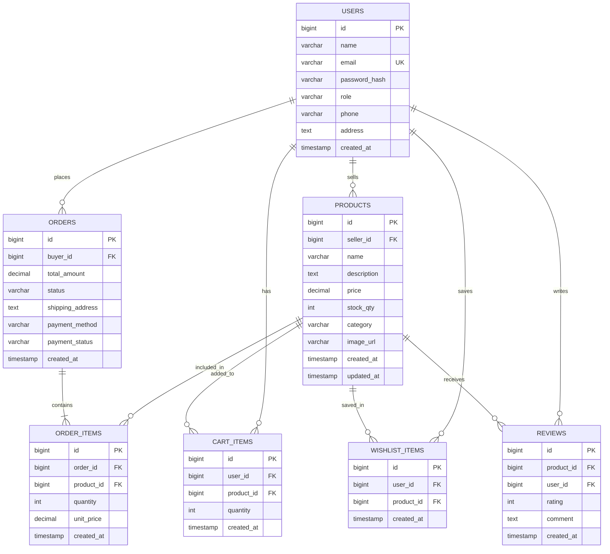
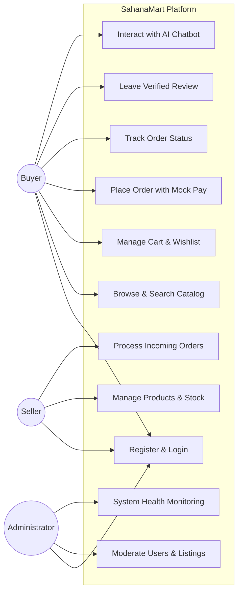
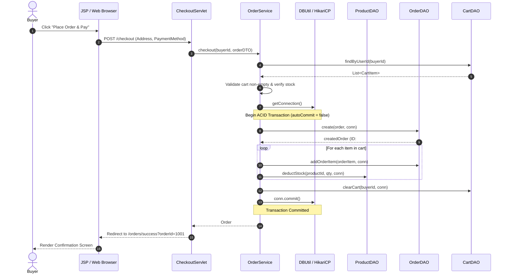

# 🛒 SahanaMart — Enterprise E-Commerce Platform

> 🌐 **Live Cloud URL:** [https://sahanamart-vpr3.onrender.com/](https://sahanamart-vpr3.onrender.com/)  
> **Anna University R2025 · Semester 3 Capstone Project**  
> **Core Stack:** Java Servlets (`javax.servlet.*`) · JDBC (`PreparedStatement`) · Apache Tomcat 9.0.x · HikariCP · H2 / MySQL · jBCrypt · JUnit 5  
> **Builder:** Solo Capstone Submission  

---

## 📌 1. Project Overview

**SahanaMart** is an enterprise-grade, multi-role e-commerce web platform engineered strictly adhering to the Anna University R2025 Java Web Development curriculum. The application supports full shopping workflows for **Buyers**, listing management and order processing for **Sellers**, system oversight for **Administrators**, and an intelligent **AI Shopping Assistant** powered by a pluggable strategy provider.

### ✨ Key Capabilities (Features F1–F8 + O1–O4)
- **F1: Secure Authentication & Role Authorization**: Multi-role signup (Buyer/Seller), seed-only Admin account, salted jBCrypt password hashing, session fixation prevention (regenerated session ID upon login), and strict `AuthFilter` RBAC.
- **F2: Seller Catalog Management**: Real-time listing creation, modification, stock level monitoring, and soft deletion.
- **F3: Buyer Browse, Search & Filter**: Keyword search, category-based filtering, and paginated product browsing.
- **F4: Interactive Shopping Cart**: Add, modify quantity, bounds checking against real inventory, and running total calculations.
- **F5: ACID Transactional Checkout**: Multi-step checkout with mock payment confirmation (UPI, Mock Card, Net Banking, COD), atomic stock deduction, and order generation inside a single database transaction.
- **F6: Order Tracking & Fulfillment**: Buyer order history and tracking; Seller incoming orders management.
- **F7: Administrator Moderation**: Comprehensive management of user accounts, order statuses, and listing moderation.
- **F8: Verified Reviews & Star Ratings**: 1-to-5 star rating and feedback submission restricted to verified purchasers.
- **O1: Save-for-Later Wishlist**: Dedicated personal wishlist with one-click migration to cart.
- **O2: Order Status Progression**: Full state machine: `PENDING` ➔ `CONFIRMED` ➔ `SHIPPED` ➔ `DELIVERED` (or `CANCELLED`).
- **O3: Seller Analytics Dashboard**: Store metrics covering active inventory count, units sold, and gross revenue.
- **O4: AI Shopping Assistant**: Domain-scoped AI chatbot (`MockChatProvider` + `GeminiChatProvider`) with per-session sliding-window rate limiting (10 req/min), in-memory query cache, and floating widget UI.

---

## 🏗️ 2. Architectural Diagrams

### D1: Entity-Relationship Diagram (ERD)


---

### D2: Use Case Diagram


---

### D3: Sequence Diagram — Transactional Place Order Flow


---

## 🛠️ 3. Technology Stack & Design Patterns

| Layer | Technology / Implementation | Design Pattern Applied |
|---|---|---|
| **Presentation** | JSP 2.3, JSTL 1.2, CSS3 Flexbox/Grid, Vanilla ES6 JS | *View Helper / Decorator* |
| **Controller** | Java Servlets 4.0 (`javax.servlet.*`) | *Front Controller Pattern* |
| **Security** | `AuthFilter` (RBAC), `EncodingFilter` (UTF-8), jBCrypt 0.4 | *Interception Filter Pattern* |
| **Service Layer** | POJO Service classes with Fail-Fast Validation | *Service Layer / Facade* |
| **Data Access** | JDBC with `PreparedStatement` only | *Data Access Object (DAO)* |
| **Connection Pool** | HikariCP 5.1.0 owned by `AppContextListener` | *Singleton / Resource Pool* |
| **Database** | H2 (File-based Persistent & In-Memory for Unit Tests) + MySQL compatible | *Active Record / Abstract Factory* |
| **AI Integration** | `ChatProvider` interface, `MockChatProvider`, `GeminiChatProvider` | *Strategy Pattern & Factory Pattern* |
| **Testing** | JUnit 5 Jupiter, Mockito 5.11 | *Mock Object Pattern* |

---

## 🚀 4. Setup & Running Instructions

### Prerequisites
- **Java SE Development Kit (JDK 17 or higher)**
- **Apache Maven 3.8+**
- Git

### Option A: One-Click Execution (Embedded Server)
SahanaMart includes an embedded Apache Tomcat 9 launcher for instant execution with zero external server configuration:

```bash
# 1. Clone the repository
git clone https://github.com/shabana/sahanamart.git
cd sahanamart

# 2. Run with Maven
mvn compile exec:java
```
The server will boot on `http://localhost:8080/`.

---

### Option B: Deploying to External Apache Tomcat 9.0.x
1. Build the deployable WAR package:
   ```bash
   mvn clean package
   ```
2. Copy `target/sahanamart.war` into your Tomcat `webapps/` folder:
   ```bash
   cp target/sahanamart.war /path/to/apache-tomcat-9.0.x/webapps/
   ```
3. Start Tomcat via `bin/startup.sh` (or `bin/startup.bat` on Windows).
4. Access the web app at `http://localhost:8080/sahanamart/`.

---

## 🔑 5. Pre-seeded Demonstration Credentials

All seeded accounts are automatically loaded upon initial boot and confirmed by `AppContextListener`:

| Role | Email | Password | Access Rights |
|---|---|---|---|
| **Administrator** | `admin@sahanamart.com` | `Admin@123` | Full system oversight, user/listing moderation, order status override |
| **Seller** | `seller@sahanamart.com` | `Seller@123` | Store dashboard, add/edit/delete listings, manage incoming orders |
| **Buyer** | `buyer@sahanamart.com` | `Buyer@123` | Browse catalog, cart, place orders, write reviews, wishlist |

---

## 🩺 6. REST API & Health Check Reference

All API endpoints reside under `/api/v1/...` and return the standard JSON envelope:
`{ "success": true, "data": ..., "error": null, "timestamp": 1728362400000 }`

| Method | Endpoint | Description |
|---|---|---|
| `GET` | `/api/v1/health` | Health check returning `{"status":"UP","db":"UP"}` |
| `POST` | `/api/v1/auth/login` | Authenticate and obtain user response DTO |
| `POST` | `/api/v1/auth/register` | Register new Buyer or Seller account |
| `GET` | `/api/v1/products` | Retrieve catalog with `keyword`, `category`, and `page` parameters |
| `GET` | `/api/v1/products/{id}` | Get detailed product specifications and ratings |
| `POST` | `/api/v1/chat` | AI Chatbot query endpoint (Rate limited: 10 msg/min) |

---

## 🧪 7. Automated Test Suite

Run the full automated test suite (in-memory H2 DAO integration + Mockito Service tests):
```bash
mvn clean test
```

---

## 📄 8. License & University Disclaimer
Submitted for **Anna University Regulation 2025 (R2025), Semester 3 Capstone Project Evaluation**. All academic honor code rules have been strictly observed.
